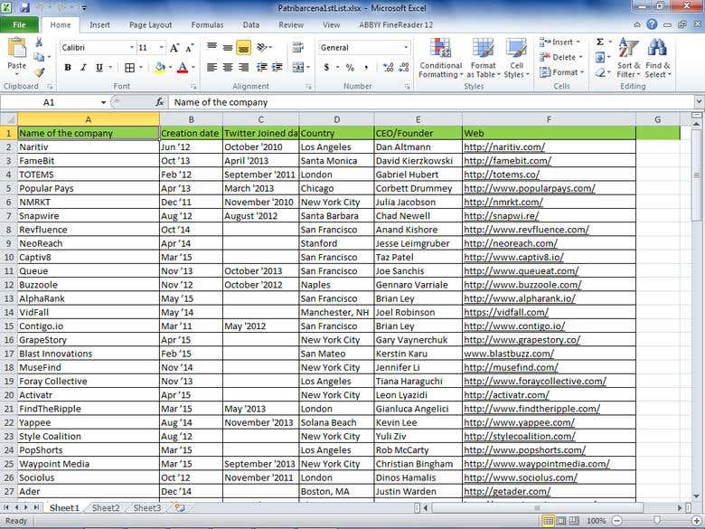

<!DOCTYPE html>
<html lang="en">
<head>
  <meta charset="UTF-8" />
  <meta name="viewport" content="width=device-width, initial-scale=1" />
  <title>Three Dot Menu with Google Search</title>
  
</head>
<body>

  <!-- থ্রি ডট বাটন -->
  <button id="menuBtn" title="Open menu">⋮</button>

  <!-- মেনু -->
  

    <a href="#" onclick="showSection('profile'); return false;">Profile</a>
    <a href="#" onclick="showSection('privacy'); return false;">Privacy Policy</a>
    <a href="#" onclick="showSection('contact'); return false;">Contact</a>
    <a href="#" onclick="showSection('about'); return false;">About</a>
    <a href="#" onclick="showSection('settings'); return false;">Settings</a>
    <a href="#" onclick="showSection('certificate'); return false;">Certificates</a>
    <a href="#" onclick="showSection('media'); return false;">Tutorial</a>
    <a href="assets/Harun_CV.pdf" download>Download CV</a>
    <a href="mailto:hmharun796@gmail.com?subject=Hello&body=I want to connect with you.">Send Email</a>
  
   

     <h2>Profile</h2>
      
I am Md. Harun Or Rashid, a skilled and dedicated professional specializing in data entry, web research, and PDF to Excel conversions. I also create Payoneer account tutorials and provide project-based services through platforms like Fiverr.

  

  

    <h2>Privacy Policy</h2>
    
All information collected through this site is used solely to improve user experience and will not be shared with third parties. You may contact me for any concerns about your data privacy.

  

  

    <h2>Contact</h2>
    

      Email: hmharun796@gmail.com 
      Phone: +880 1648-131500 
      Facebook: <a href="https://www.facebook.com/share/r/1BcEg68nzy/" target="_blank">Visit My Facebook</a> 
      WhatsApp: <a href="https://wa.me/8801648131500" target="_blank">Chat on WhatsApp</a>
    

  

  

    <h2>About</h2>
    
I'm passionate about providing efficient data entry and digital solutions. My goal is to ensure client satisfaction through quality work and timely delivery. I also manage a YouTube channel for educational content.

  

  

    <h2>Settings</h2>
    

      Website Theme: Default 
      Language: English 
      Notifications: Enabled 
      <em>(Settings options can be expanded based on development needs)</em>
    

  

  

    <h2>Certificates</h2>
    <ul>
      <li></li>
      <li></li>
      <li></li>
    </ul>
  

  

    <h2>Tutorial</h2>
    
Watch my video tutorials on YouTube:

    <video controls width="320">
      <source src="video.mp4" type="video/mp4" />
      Your browser does not support the video tag.
    </video>
    
<a href="https://youtube.com/@mdharun-n6j" target="_blank">Visit My YouTube Channel</a>

  

  
   
   

  

</body>
</html>
