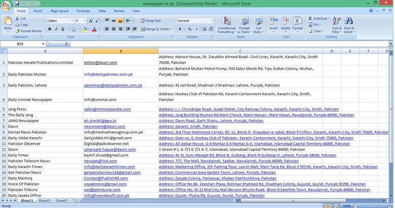

<!DOCTYPE html>
<html lang="en">
<head>
  <meta charset="UTF-8" />
  <meta name="viewport" content="width=device-width, initial-scale=1.0"/>
  <title>Harun's Personal Website</title>
  
  <!-- Google CSE Script -->
  
</head>
<body>

  <!-- Three dot button -->
  
☰

  <!-- Menu content -->
  

    <a href="#" onclick="showSection('profile')">Profile</a>
    <a href="#" onclick="showSection('privacy')">Privacy Policy</a>
    <a href="#" onclick="showSection('contact')">Contact</a>
    <a href="#" onclick="showSection('about')">About</a>
    <a href="#" onclick="showSection('settings')">Settings</a>
    <a href="#" onclick="showSection('certificate')">Certificates</a>
    <a href="#" onclick="showSection('media')">Tutorial</a>
    <a href="assets/Harun_CV.pdf" download>Download CV</a>
    <a href="mailto:hmharun796@gmail.com?subject=Hello&body=I want to connect with you.">Send Email</a>
  

  <!-- Google Search Bar always visible on homepage -->
  

  <!-- Sections -->
  

    <h2>Profile</h2>
    
I am Md. Harun Or Rashid, a skilled and dedicated professional specializing in data entry, web research, and PDF to Excel conversions...

  

  

    <h2>Privacy Policy</h2>
    
All information collected through this site is used solely to improve user experience...

  

  

    <h2>Contact</h2>
    
Email: hmharun796@gmail.com Phone: +880 1648-131500 
    Facebook: <a href="https://www.facebook.com/share/r/1BcEg68nzy/" target="_blank">Visit</a> 
    WhatsApp: <a href="https://wa.me/8801648131500" target="_blank">Chat</a>

  

  

    <h2>About</h2>
    
I'm passionate about providing efficient data entry and digital solutions...

  

  

    <h2>Settings</h2>
    
Website Theme: Default Language: English Notifications: Enabled

  

  

    <h2>Certificates</h2>
    <ul>
      <li></li>
      <li></li>
      <li></li>
    </ul>
  

  

    <h2>Tutorial</h2>
    <video controls width="320">
      <source src="video.mp4" type="video/mp4" />
      Your browser does not support the video tag.
    </video>
    
<a href="https://youtube.com/@mdharun-n6j" target="_blank">Visit My YouTube Channel</a>

  

  

</body>
</html>
